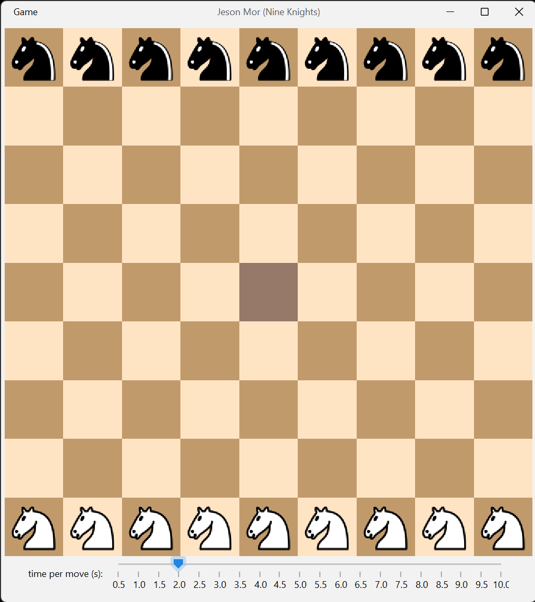

# Jeson Mor (Nine Knights)

Two-player chess-like strategy game. A player wins by being first to occupy the central square or by capturing all enemy knights.\
https://en.wikipedia.org/wiki/Jeson_Mor



## How to run the project

1. Start SBT server
```
sbt
```
2. Run the project
```
run
```

## How to play

- To make a move drag and drop your knight to one of the highlighted squares and wait for the computer to make its move. Computer opponent uses `Alpha-Beta Pruning` algorithm.
- Use slider to adjust the amount of time given to computer to make its move. The more time it gets, the stronger it plays.
- Start a new game by clicking Game -> New.
